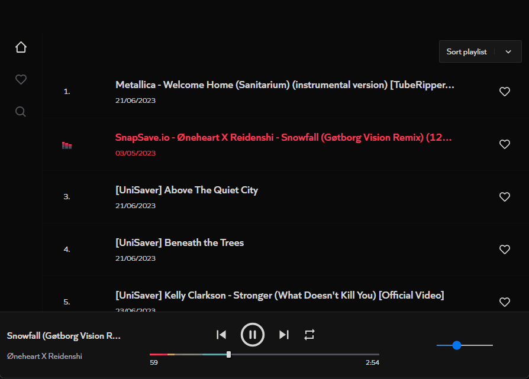

# Codify

This project are in progress.

## Preview

## Usage
 - Clone this repository with `git clone https://github.com/guilhermevialle/Codify.git`.
 - Now you gonna enter on both app sides (server and client), and run `npm i` or `yarn add`.
 - Now enter on client and start the Client-side app using `npm run dev`.
 - In other terminal tab, start Server-side app using `nmp run dev`.
